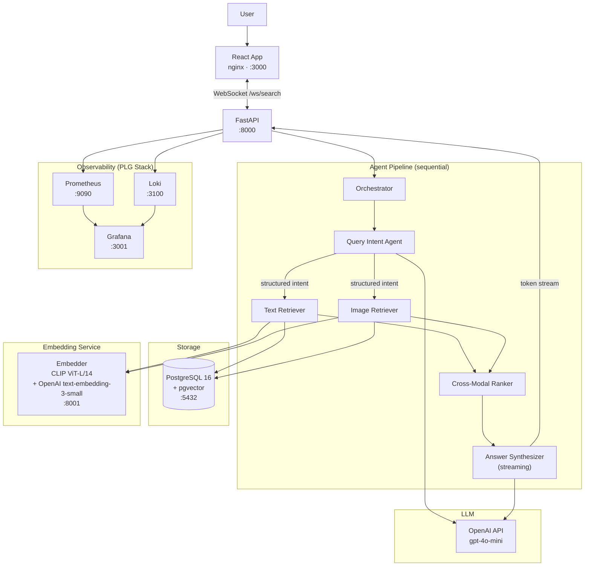

# WGSN Multi-Modal Agentic Search System

## Overview


An AI-powered search and question-answering system over a mixed-media content archive containing long-form text documents, visual assets, and associated metadata.

---

## How to run

Check `env.example`

You will need `OPENAI_API_KEY`. Once you set you just:
```
docker compose up --build
```

Services are available on:

- http://localhost:3000/ - UI, client ready product. You can't ask questions atm, some data was prepared in "/example_data". You would need to relocate some resources, that's why is not in the building pipe. If you want to test it just run:

```python3 -m seed```

- http://localhost:3001/ - grafana tool for monitoring, dashboards

- http://localhost:9090/ - prometheus db itself that grafana is build on top of


Other important port mappings:

- 8000 - FastAPi
- 8001 - Embedding Models service
- 5432 - Postgres
- 3100 - loki

---

## Key decisions made - engineer's thought process

- For simplicity and easy integration and least dependencies I am picking postgres + pgvector as the core of my memory

- docker for isolation and compose for orchestration - mostly because theyre easy for local development and demo, even for MVP deployment - services will still be isolated, the communication will be handled internally and in future - this is easy to switch to k8s or cloud specific service if needed. 

- Claude - I using Claude Code for AI assistance tool. Its specifically designed for this project - you can see the subagents in .claude/agents and the rules of the project in CLAUDE.MD. For performance between sessions I am manually updating its memory, but i am not pushing this

- Grafana / Prometheus / Loki - this is one of the industry standard stacks for monitoring/alerting that is cloud agnostic and I am familiar with it. 

- LLM - picking gpt-mini as initial MVP LLM. Obviously its pretty easy to switch to other models if needed in future

- Open AI text embedder-small and CLIP - same as above

- FastAPI - out of the box async, which makes it easy to scale horizontally(this is important because the product is heavy I/O oriented). Kind of industry standard nowadays

- React - doesn't really matter

---

## System Overview

```
                        ┌─────────────────────────────────────────────────┐
                        │                  Docker Network                  │
                        │                                                  │
  ┌──────────┐  WS/HTTP │  ┌─────────────────────────────────────────┐    │
  │  React   │◄────────►│  │              FastAPI  :8000             │    │
  │  :3000   │          │  │                                         │    │
  └──────────┘          │  │  Intent → Retrieval → Rank → Synthesize │    │
                        │  └──────────┬──────────────────┬───────────┘    │
                        │             │                  │                 │
                        │  ┌──────────▼────────┐  ┌─────▼──────────────┐ │
                        │  │    PostgreSQL      │  │  Embedder  :8001   │ │
                        │  │    + pgvector      │  │  CLIP + text-emb   │ │
                        │  │    :5432           │  └────────────────────┘ │
                        │  └───────────────────┘                          │
                        │                                                  │
                        │  ┌─────────────┐  ┌──────────┐  ┌───────────┐  │
                        │  │ Prometheus  │  │   Loki   │  │  Grafana  │  │
                        │  │   :9090     │  │  :3100   │  │   :3001   │  │
                        │  └─────────────┘  └──────────┘  └───────────┘  │
                        └─────────────────────────────────────────────────┘
                                                    │
                                                    ▼ external
                                          ┌──────────────────┐
                                          │   OpenAI API     │
                                          │   gpt-4o-mini    │
                                          │   text-embedding │
                                          └──────────────────┘
```

---

## Architecture Detail



---

## Services

| Service | Image | Port | Responsibility |
|---|---|---|---|
| `postgres` | `pgvector/pgvector:pg16` | 5432 | Vector store for text chunks and image embeddings |
| `embedder` | custom Python | 8001 | Runs CLIP ViT-L/14 locally + proxies OpenAI text embeddings |
| `api` | custom Python | 8000 | FastAPI — orchestrator, agents, WebSocket endpoint |
| `react` | custom Node build → nginx | 3000 | React frontend, connects via WebSocket |
| `prometheus` | `prom/prometheus` | 9090 | Scrapes `/metrics` from `api` and `embedder` |
| `loki` | `grafana/loki` | 3100 | Receives structured JSON logs from `api` via Promtail |
| `grafana` | `grafana/grafana` | 3001 | Dashboards over Prometheus + Loki |

All services communicate over a shared Docker network (`wsgn-net`). Only `react`, `api`, and `grafana` expose host ports.

---

## Agent Pipeline

### 1. Query Intent Agent
**Input:** raw query string
**Output:** normalised query, modalities (`text` / `image` / `both`), metadata filters, expanded terms, confidence score
**LLM-backed:** gpt-4o-mini with structured output (JSON schema enforced)
**Why an agent:** handles ambiguous, compound, and underspecified queries that rule-based parsing cannot resolve
**Fallback:** on LLM failure → default to `modalities=["text"]`, `confidence=0.0`

### 2. Text Retriever
**Input:** normalised query, expanded terms, filters, top-k
**Output:** ranked text chunks with `doc_id`, `source`, `score`, `text`
**Strategy:** hybrid search — PostgreSQL `tsvector` full-text search + pgvector cosine similarity (HNSW index), results fused via RRF at query time
**Why an agent:** decides at runtime whether to use dense-only, full-text-only, or hybrid depending on query type and applies dynamic metadata pre-filtering

### 3. Image Retriever
**Input:** normalised query, filters, top-k, optional reference image URL
**Output:** ranked image results with `image_id`, `source`, `clip_score`, `caption`
**Strategy:** CLIP text encoder converts query to 768-dim vector → cosine search over `image_embeddings` table (HNSW index on pgvector)
**Caption enrichment:** if image has no stored caption, call gpt-4o-mini vision to generate one (write-through cache back to DB)
**Why an agent:** decides between text-to-image, image-to-image, or hybrid search modes at runtime

### 4. Cross-Modal Ranker
**Input:** text chunks + image results + query intent
**Output:** unified ranked list, max 10 items, tagged by modality
**Strategy:** Normalised Score Fusion (NSF) — scores from both agents are already normalised to [0,1]; modality weights applied based on detected intent; diversity cap prevents >60% from one modality
**Why an agent:** modality weights and diversity constraints require reasoning about intent confidence

### 5. Answer Synthesizer
**Input:** ranked context items, original query
**Output:** answer with inline citations `[1]`, `[img-1]`, citation list, `is_grounded` flag
**LLM-backed:** gpt-4o-mini with strict system prompt (no external knowledge, every claim must cite a source)
**Streaming:** tokens streamed back through FastAPI WebSocket to React in real time
**Self-check:** post-generation grounding verification — flags unsupported claims rather than suppressing them

---

## Multi-Modal Retrieval Strategy

### Embedding Spaces

Text and images live in **separate vector spaces**. They are never co-embedded.

| Modality | Model | Dimensions | Index |
|---|---|---|---|
| Text chunks | `text-embedding-3-small` (OpenAI) | 1536 | HNSW via pgvector |
| Images | CLIP `ViT-L/14` (local) | 768 | HNSW via pgvector |

> **Why separate spaces?** Co-embedding with a shared CLIP space degrades text retrieval quality significantly for long-form documents. CLIP is trained on image-caption pairs, not long text. Keeping separate spaces with a fusion layer at ranking time gives better per-modality recall.

### Fusion

Late fusion via **Normalised Score Fusion (NSF)**:

1. Each retrieval agent normalises its scores to [0, 1]
2. Modality weights applied based on detected intent: `text_weight + image_weight = 1.0`
3. Items sorted by weighted score; diversity cap enforced
4. No re-ranking LLM call — scoring is deterministic and auditable

### Hybrid Text Search

PostgreSQL `tsvector` (full-text, keyword) + pgvector (semantic dense), fused via **Reciprocal Rank Fusion (RRF)** inside the text retriever. This avoids the O(n) penalty of filtering-then-searching by doing both in parallel and merging rank lists.

---

## Database Schema

```sql
-- Text chunks
CREATE TABLE text_chunks (
    id          UUID PRIMARY KEY,
    doc_id      TEXT NOT NULL,
    source      TEXT NOT NULL,
    chunk_index INT NOT NULL,
    text        TEXT NOT NULL,
    metadata    JSONB,
    embedding   vector(1536),
    tsv         tsvector GENERATED ALWAYS AS (to_tsvector('english', text)) STORED,
    created_at  TIMESTAMPTZ DEFAULT now()
);
CREATE INDEX ON text_chunks USING hnsw (embedding vector_cosine_ops);
CREATE INDEX ON text_chunks USING gin (tsv);

-- Image assets
CREATE TABLE image_assets (
    id          UUID PRIMARY KEY,
    image_id    TEXT NOT NULL,
    source      TEXT NOT NULL,
    caption     TEXT,
    metadata    JSONB,
    embedding   vector(768),
    created_at  TIMESTAMPTZ DEFAULT now()
);
CREATE INDEX ON image_assets USING hnsw (embedding vector_cosine_ops);
```

---

## Execution Flow

```
User query
    │
    ▼
WebSocket /ws/search (FastAPI)
    │
    ▼
Orchestrator
    │
    ├─► Query Intent Agent ──► gpt-4o-mini
    │       │
    │       └─► QueryIntent { modalities, filters, expanded_terms, confidence }
    │
    ├─► [parallel if both modalities requested]
    │       ├─► Text Retriever ──► Embedder ──► PostgreSQL (pgvector + tsvector)
    │       └─► Image Retriever ──► Embedder (CLIP local) ──► PostgreSQL (pgvector)
    │
    ├─► Cross-Modal Ranker ──► unified ranked list (NSF fusion)
    │
    └─► Answer Synthesizer ──► gpt-4o-mini (streaming)
            │
            └─► token stream ──► WebSocket ──► React UI
```

**Decision points:**
- If `confidence < 0.5` on intent: default to `modalities=["both"]`
- If image retrieval returns 0 results: proceed with text only, log warning
- If text retrieval returns <3 results: log warning, widen `top_k` by 2x and retry once
- If synthesis `is_grounded=False`: return answer with a visible warning in the UI, do not suppress

---

## Observability — PLG Stack

**Prometheus + Loki + Grafana** — the standard open-source observability triad.

> **Is this appropriate for LLM monitoring?** Yes, with custom metrics. Prometheus is not LLM-aware by default, but the FastAPI `/metrics` endpoint exposes custom counters and histograms for everything below. Loki handles structured JSON logs for per-trace inspection. Together they cover all five evaluation metrics without needing a managed LLM observability platform.

### Metrics (exposed via `/metrics`)

| Metric | Type | Description |
|---|---|---|
| `search_retrieval_recall_at_k` | Gauge | Ground-truth hit rate in top-K (labelled by modality) |
| `search_mrr` | Gauge | Mean reciprocal rank across eval set |
| `search_hallucination_rate` | Counter | Requests where `is_grounded=False` / total |
| `search_e2e_latency_seconds` | Histogram | Full pipeline latency (P50/P95/P99 via buckets) |
| `search_citation_coverage` | Gauge | % of answer sentences containing a citation |
| `search_agent_latency_seconds` | Histogram | Per-agent latency, labelled by agent name |
| `openai_tokens_total` | Counter | Token usage labelled by model + agent |

### Structured Logs (→ Loki)

Every pipeline run emits one JSON log line at completion:

```json
{
  "trace_id": "uuid",
  "query": "...",
  "intent": { "modalities": ["text", "image"], "confidence": 0.88 },
  "text_retrieval": { "count": 18, "latency_ms": 290, "mode": "hybrid" },
  "image_retrieval": { "count": 9, "latency_ms": 510 },
  "ranking": { "text_count": 6, "image_count": 4 },
  "synthesis": { "is_grounded": true, "citations": 5, "latency_ms": 740 },
  "total_latency_ms": 1580
}
```

Grafana dashboards link metrics panels to log queries via `trace_id` for drill-down.

### Regression Detection

Eval harness runs on merge to main. Baseline stored in `tests/eval/baseline_metrics.json`.
Any metric regression >5% fails CI.

---

## Technology Choices

| Component | Choice | Notes |
|---|---|---|
| LLM | `gpt-4o-mini` (OpenAI) | Cost-efficient, structured output support, vision capable |
| Text Embeddings | `text-embedding-3-small` (OpenAI) | 1536-dim, strong quality/cost ratio |
| Image Embeddings | CLIP `ViT-L/14` (local, `sentence-transformers`) | OpenAI has no CLIP API — must run locally in `embedder` service |
| Vector DB | PostgreSQL 16 + pgvector | Simplicity: single DB for relational + vector data. HNSW index handles 768-dim at this scale |
| Hybrid text search | PostgreSQL `tsvector` + pgvector RRF | Native to Postgres, no extra service needed |
| API | FastAPI + WebSockets | Async, streaming-native, OpenAPI docs included |
| Frontend | React + WebSocket client | Streams tokens in real time |
| Containers | Docker Compose | Service isolation, shared network, reproducible env |
| Observability | Prometheus + Loki + Grafana | Full open-source PLG stack; custom metrics cover all LLM eval requirements |

---

## Grounding & Anti-Hallucination

1. **Strict system prompt** — the synthesiser is forbidden from using external knowledge; every claim must cite a retrieved source by `[ref_id]`
2. **Context-only generation** — only the top-10 ranked items are passed to the LLM; nothing else is in context
3. **Post-generation self-check** — a second LLM call extracts factual claims and verifies each against the cited excerpt; `is_grounded=False` if any claim fails
4. **UI transparency** — unsupported claims are flagged visibly in the React UI; the answer is never suppressed
5. **Provenance on every item** — every chunk and image carries `doc_id`, `source`, `score` throughout the pipeline

---

## Running Locally

```bash
cp .env.example .env          # add OPENAI_API_KEY
docker compose up --build
```

| URL | Service |
|---|---|
| http://localhost:3000 | React search UI |
| http://localhost:8000/docs | FastAPI OpenAPI docs |
| http://localhost:3001 | Grafana dashboards |
| http://localhost:9090 | Prometheus |

---

## Key Trade-offs

| Decision | Alternative | Why this choice |
|---|---|---|
| pgvector over Qdrant | Qdrant (specialised vector DB) | Simpler ops: one DB for everything. Qdrant wins at >10M vectors or complex filtered search — not needed here |
| Separate embedding spaces | Shared CLIP space for both | CLIP degrades on long-form text retrieval. Separate spaces + late fusion gives better per-modality recall |
| NSF fusion over learned re-ranker | Cross-encoder re-ranker (e.g. Cohere Rerank) | Deterministic, auditable, zero added latency. Learned re-ranker adds 200-400ms and cost; justified only at higher scale |
| gpt-4o-mini over larger models | gpt-4o, Claude Sonnet | Sufficient for structured intent extraction and citation-constrained synthesis; 10x cheaper |
| PLG observability over managed LLMOps | LangSmith, Langfuse | No vendor lock-in; custom Prometheus metrics cover all eval requirements; Loki handles trace-level log inspection |
